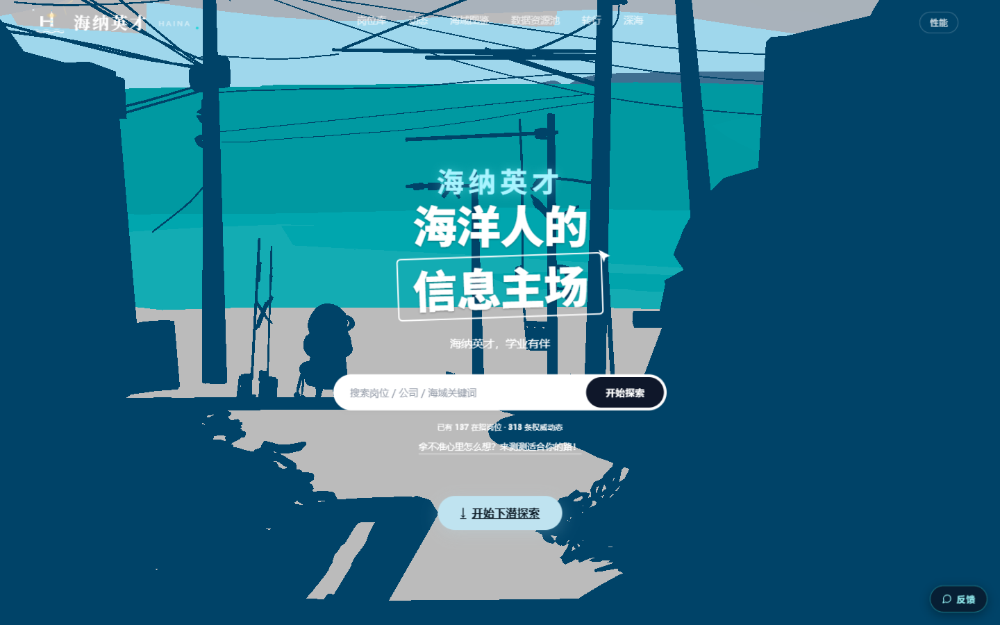
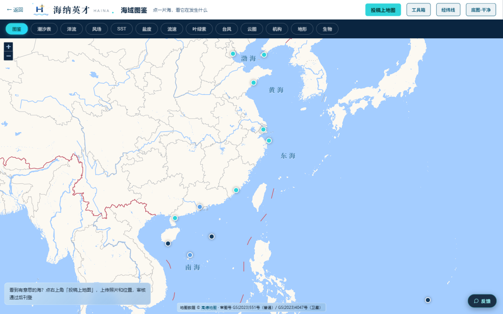
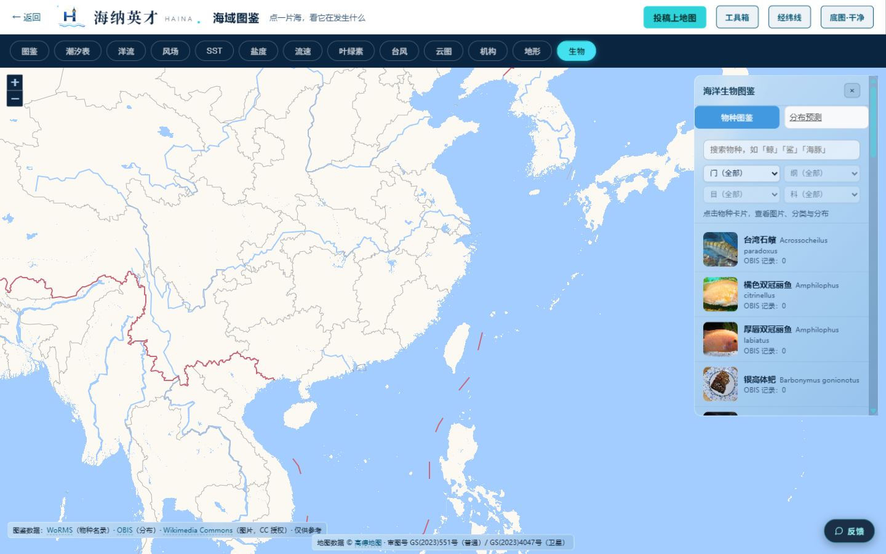

<div align="center">

# 🌊 海纳 · hainahub.cn

**海洋人的信息主场** — 个人公益海洋知识平台

[](https://github.com/huojian17-star/hainahub/stargazers)
[](LICENSE)


**[🌐 在线访问 hainahub.cn](https://hainahub.cn)** · [物种数据集](https://github.com/huojian17-star/marine-species-zh)



</div>

## ✨ 这是什么

一个人在 1.8GB 内存的服务器上跑起来的海洋知识平台：

| | |
|---|---|
| 🐠 **物种图鉴** | 4662 种海洋生物，WoRMS 分类基准 + OBIS 分布数据 + CC 授权图片，门/纲/目/科逐级下钻 |
| 🤖 **AI 智能解读** | DeepSeek 驱动，流式输出、来源标注、降级策略 |
| 🗺️ **海域图鉴** | 交互式海图：潮汐、SST、叶绿素、盐度、洋流、风场、台风、云图、地形 13 个图层 |
| 🚨 **生态预警（SDM）** | 12 个物种分布模型（交叉验证 AUC 0.997+），季节路由消除误报 |
| 💼 **岗位与动态** | 海洋领域招聘与科研动态，爬虫管线 + LLM 结构化解析 |

<div align="center">

| 海域图鉴 | 物种图鉴 |
|---|---|
|  |  |

</div>

## 📊 工程数字

<div align="center">

| 核心接口响应 | 服务器内存 | 物种数据 | 数据覆盖 |
|:---:|:---:|:---:|:---:|
| **24s → 4.4s** | **1.8 GB** 全站承载 | **4662** 种 | 近岸数据缺失 90% → **7/7** 全覆盖 |

</div>

近岸卫星数据单日缺失率约 90%，通过 SNPP → MODIS → CMEMS 多源兜底数据链实现全部监测点覆盖；
全站 CDN 化 + 缓存治理，在一台最低配云服务器上稳定运行。

## 🚀 快速开始

```bash
git clone https://github.com/huojian17-star/hainahub.git
cd hainahub
pip install flask gunicorn requests

export DEEPSEEK_API_KEY=你的key        # AI 解读 / 预警 / 结构化解析
export GEOVIS_SECRET_ID=你的id          # 海洋数据可视化
export GEOVIS_SECRET_KEY=你的key
python web/app.py                       # 开发模式
# 生产: gunicorn -w 4 'web.app:app'
```

<details>
<summary><b>全部环境变量</b></summary>

| 变量 | 用途 |
|------|------|
| `DEEPSEEK_API_KEY` | AI 解读 / 生态预警 / 采集管线结构化解析 |
| `GEOVIS_SECRET_ID` / `GEOVIS_SECRET_KEY` | 星图地球数据云（海洋数据图层） |
| `EXA_API_KEY` | 联网检索增强 |
| `HAINA_LLM_MODEL` / `HAINA_LLM_KEY` / `HAINA_LLM_BASE_URL` | 采集管线 LLM 配置 |

</details>

## 📁 目录结构

```
web/
├── app.py            # Flask 路由与接口
├── templates/        # 页面模板
├── static/js|css     # 前端资源
├── sdm_ecowarn.py    # 生态预警（物种分布模型）
├── sdm_rag.py        # 语义检索
└── ...
crawler/
├── sources.py        # 来源配置
├── *_crawler.py      # 各源采集
├── llm_parse.py      # LLM 结构化解析
└── store.py          # 入库
```

## 🔗 相关仓库

- [marine-species-zh](https://github.com/huojian17-star/marine-species-zh) — 4662 种海洋生物结构化数据集（CC BY-SA）

## 📄 License

[MIT](LICENSE) © hainahub.cn

物种图片版权归各自作者（协议见站内逐张标注）。个人公益项目，仅供学习交流。

<div align="center">

**[海纳英才，学业有伴](https://hainahub.cn)**

</div>
